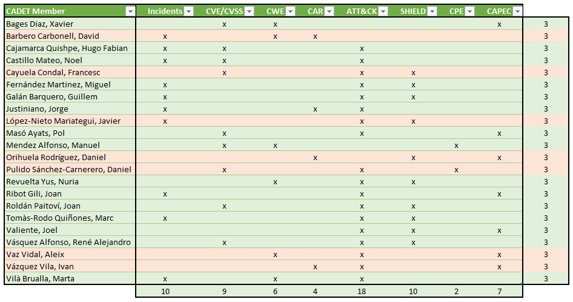

```{r setup, include=FALSE}
knitr::opts_chunk$set(echo = TRUE)
if (!dir.exists("data")) dir.create("data")
if (!dir.exists("data-raw")) dir.create("data-raw")
```


```{r load_packages, echo=FALSE}
suppressPackageStartupMessages(library("dplyr"))
library("tidyr")
library("DataExplorer")
library("ggridges")
library("ggplot2")
library("hrbrthemes")
library("viridisLite")
library("viridis")
```

```{r install_mitre, echo=FALSE}
# devtools::install_github(repo = "motherhack3r/mitre", ref = "devel")
library(mitre)
```

# Introducción

Como miembros del CADET (Cybersecurity Analyst Data Experts Team) se solicita 
vuestra colaboración para el análisis de los incidentes que afectaron con anterioridad.




## Objetivo

El objetivo consiste en responder las siguientes preguntas:

  1. ¿Quien estaba detras de los ataques?
  2. ¿Cual fue el objetivo?
  3. ¿Cómo realizaron los ataques?
  4. ¿Cómo podemos protegernos?
  5. ¿Qué podemos hacer para prevenir futuros ataques?
  6. ¿Sería posible predecir ataques?

## Alcance

Respondiendo 3 preguntas se consigue una puntuación de 5 sobre 10.  
Las siguientes preguntas suman 2 puntos, pudiendo conseguir un máximo de 10.

# Data sets

```{r mitre_download_feeds, cache=TRUE, echo=FALSE, warning=FALSE, results='hide'}
mitre::updateRawData(verbose = FALSE)
```

```{r mitre_create_datasets, cache=TRUE, echo=FALSE, warning=FALSE, results='hide'}
mitre.data <- mitre::getMitreNetwork(verbose = F)
```

## Incidentes

Load incidents data set and unnest ATT&CK column.

```{r ds_incidents}
raw_incidents <- readRDS(file = "data/incidents.rds")
incidents <- raw_incidents %>% unnest(mitre_attack)
summary(incidents)
```
Analyze character columns to identify unique values.

```{r ds_inc_factors}
apply(incidents, 2, function(x) length(unique(x)))
```

Set character columns as factor.

```{r}
incidents <- incidents %>%
  mutate_if(is.character, as.factor)
summary(incidents)
```
```{r fig.width=8, fig.height=8}
plot_correlation(incidents)
```

Seems that Tactic and Industry values are interesting.
Let's see industry distribution along time.

```{r, warning=FALSE}
# Ref: https://www.r-graph-gallery.com/294-basic-ridgeline-plot.html

ggplot(incidents, aes(x = first_event_ts, y = industry, fill = industry)) +
  geom_density_ridges() +
  theme_ridges() + 
  theme(legend.position = "none")

```
  
The time series distribution is based on first event. We can calculate the duration of the incidents using containment time.

```{r fig.width=8, fig.height=8, warning=FALSE}
# Ref: https://www.r-graph-gallery.com/320-the-basis-of-bubble-plot.html
incidents <- incidents %>% mutate(duration = round(as.numeric(containment_ts - first_event_ts)/3600, 2))

incidents %>%
  arrange(desc(first_event_ts)) %>%
  # mutate(country = factor(country, country)) %>%
  ggplot(aes(x=first_event_ts, y=industry, size=duration, fill=tactic)) +
  geom_point(alpha=0.5, shape=21, color="black") +
  scale_size(range = c(.1, 20), name="Duration") +
    scale_fill_viridis(discrete=TRUE, guide=FALSE, option="A") +
    theme_ipsum() +
    theme(legend.position="bottom") +
    ylab("Industry") +
    xlab("Incidents") +
    theme(legend.position = "none")
```

## CVE

__TODO__

```{r ds_cve}
raw_cves <- mitre.data$standards$cve
```

## CWE

__TODO__

```{r ds_cwe}
raw_cwes <- mitre.data$standards$cwe
```

## ATT&CK

__TODO__

```{r ds_attck}
raw_attck <- mitre.data$standards$attck
```

## SHIELD

__TODO__

```{r ds_shield}
raw_shield <- mitre.data$standards$shield
```

## CPE

__TODO__

```{r ds_cpe}
raw_cpes <- mitre.data$standards$cpe
```


## CAR

__TODO__

```{r ds_car}
```

# Data Model

__TODO: Actualizar y completar el modelo__


# Análisis

## ¿Quien estaba detras de los ataques?

## ¿Cuál fue el objetivo?

## ¿Cómo realizaron los ataques?

## ¿Cómo podemos protegernos?

## ¿Qué podemos hacer para prevenir futuros ataques?

## ¿Sería posible predecir ataques?


